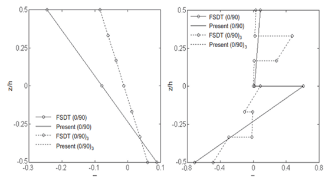
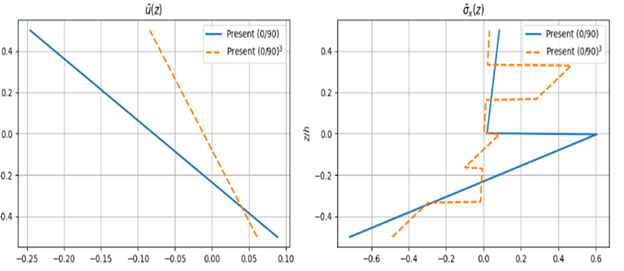
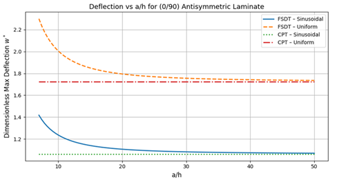
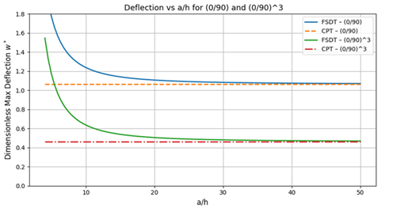

# Laminated Composite Plate Analysis — CPT vs FSDT

## Abstract
This repository provides a reproducible implementation of **Classical Plate Theory (CPT)** and **First-Order Shear Deformation Theory (FSDT)** for laminated composite plates. The notebook computes laminate stiffness matrices (A, B, D and transverse shear), deflections, and through-thickness stress/displacement fields for simply supported antisymmetric cross-ply laminates. Results are validated against benchmark solutions reported in the literature, confirming that CPT is accurate for very slender plates (large \(a/h\)), while FSDT is required for thick to moderately thick laminates where shear effects are non-negligible.

## Methods (brief)
- Orthotropic lamina properties are assembled into reduced stiffnesses \(\mathbf{Q}\) and transformed \(\bar{\mathbf{Q}}\).
- Laminate stiffnesses are obtained by
$$[A_{ij}, B_{ij}, D_{ij}] = \int_{-h/2}^{h/2} \bar{Q}_{ij}(1, z, z^2)\,dz$$
- In FSDT, transverse displacement is partitioned \$w(x,y) = w_b(x,y) + w_s(x,y)$, leading to four mid-plane unknowns \((u,v,w_b,w_s)\) and a shear-resultant law with correction factor \(k=5/6\).
- Closed-form (Navier-type) solutions are used for simply supported plates under sinusoidal or uniform loading; the notebook reproduces the comparison tables and figures.

---
## Benchmark Comparisons & Explanations

### 1) Through-thickness displacement $\bar{u}(z)$ and normal stress $\bar{\sigma}_x(z)$

**Figure 1 — Benchmark (literature)**  
  
*Through-thickness $\bar{u}(z)$ and $\bar{\sigma}_x(z)$ for antisymmetric cross-ply laminates (0/90) and $(0/90)^3$ under sinusoidal load; reproduced here for academic comparison.*

**What to look for**
- $\bar{u}(z)$ is **linear** within each ply (consistent with CLT/FSDT kinematics).
- $\bar{\sigma}_x(z)$ is **piecewise** through thickness; slope changes at ply interfaces because plies have different stiffnesses.
- $(0/90)^3$ shows more slope changes than $(0/90)$ due to additional interfaces.

**Figure 2 — Present study (this code)**  

**What to look for**
- Computed $\bar{u}(z)$ is linear per ply and antisymmetric about the mid-plane — matches the benchmark trend.
- $\bar{\sigma}_x(z)$ exhibits the expected layer-wise pattern; surface values align with Table B below.
- Confirms correct $\bar{\mathbf Q}$ transformation and ABD assembly in the notebook.

---

### 2) Deflection vs thickness ratio $(a/h)$

**Figure 3 — Benchmark (literature)**  
  
*Variation of non-dimensional deflection with $(a/h)$ for antisymmetric $(0/90)$.*

**What to look for**
- For **thick plates** (small $(a/h)$), FSDT predicts **larger** deflection than CPT because CPT ignores shear.
- As $(a/h)$ increases, FSDT **converges** to CPT; shear effects vanish in the thin-plate limit.

**Figure 4 — Present study (this code)**  

**What to look for**
- FSDT curves decrease with $(a/h)$ and approach the CPT plateaus — same qualitative behavior as the benchmark.
- $(0/90)^3$ deflects **less** than $(0/90)$ because extra plies raise bending stiffness.

---

### Table A — Non-dimensional deflection for $(0/90)_n$ under sinusoidal load

| a/h | Theory          | n=1    | n=3    |
|:---:|:----------------|:------:|:------:|
|  4  | ZSDT [74]       | 2.0010 | 1.5410 |
|     | TSDT [70]       | 1.9985 | 1.5411 |
|     | FSDT [70]       | 2.1492 | 1.5473 |
|     | **Present CPT** | 1.0636 | 0.4617 |
|     | **Present FSDT**| 2.1492 | 1.5473 |
| 10  | ZSDT [74]       | 1.2160 | 0.6380 |
|     | TSDT [70]       | 1.2161 | 0.6382 |
|     | FSDT [70]       | 1.2373 | 0.6354 |
|     | **Present CPT** | 1.0636 | 0.4617 |
|     | **Present FSDT**| 1.2373 | 0.6354 |
| 20  | ZSDT [74]       | 1.1020 | 0.5060 |
|     | TSDT [70]       | 1.1018 | 0.5060 |
|     | FSDT [70]       | 1.1070 | 0.5053 |
|     | **Present CPT** | 1.0636 | 0.4617 |
|     | **Present FSDT**| 1.1070 | 0.5053 |
| 100 | ZSDT [74]       | 1.0650 | 0.4630 |
|     | TSDT [70]       | 1.0651 | 0.4635 |
|     | FSDT [70]       | 1.0653 | 0.4635 |
|     | **Present CPT** | 1.0636 | 0.4617 |
|     | **Present FSDT**| 1.0653 | 0.4635 |

**Explanation**
- **Match to literature:** “Present FSDT” equals published FSDT values to ~4 decimals across $(a/h)$.
- **CPT vs FSDT:**  
  - At $(a/h)=4$ → CPT **underestimates** deflection strongly (shear neglected).  
  - At $(a/h)=10$–$20$ → gap shrinks.  
  - At $(a/h)=100$ → difference $\le 0.4\%$ (negligible).
- **Rule of thumb:** Use **FSDT** for thick/moderately thick plates; **CPT** is fine for large $(a/h)$.

---
### Table B — $(a/h)=10$: $\bar{u}(h/2)$, $\bar{\sigma}_x(-h/2)$, $\bar{\sigma}_{xy}(-h/2)$, $\bar{\sigma}_{xz}(-h/4)$ (sinusoidal load)

| n | Method  | $\bar{u}(h/2)$ | $\bar{\sigma}_x(-h/2)$ | $\bar{\sigma}_{xy}(-h/2)$ | $\bar{\sigma}_{xz}(-h/4)$ |
|:-:|:--------|:--------------:|:----------------------:|:-------------------------:|:-------------------------:|
| 1 | FSDT    |    -0.2457     |        -0.7157         |          0.0525           |           0.2728          |
|   | Present |    -0.2457     |        -0.7157         |          0.0525           |           0.2728          |
| 3 | FSDT    |    -0.0839     |        -0.4881         |          0.0228           |           0.1091          |
|   | Present |    -0.0839     |        -0.4881         |          0.0228           |           0.1091          |

---

## Files
- `notebooks/Composite_Final_Code_17_April.ipynb` — full workflow (ABD, FSDT/CPT solutions, plots).
- `requirements.txt` — Python dependencies.
- `.gitignore`, `LICENSE`, `CITATION.cff` — housekeeping.

## License
MIT (see `LICENSE`).

## How to cite
If you use this repository, please cite both this code and the underlying theory papers below.

## References
- **Thai, H.-T., & Choi, D.-H. (2013).** *A simple first-order shear deformation theory for laminated composite plates.* Composite Structures, 106, 754–763.
- **Reddy, J. N. (2004).** *Mechanics of Laminated Composite Plates and Shells: Theory and Analysis.* 2nd ed., CRC Press.
